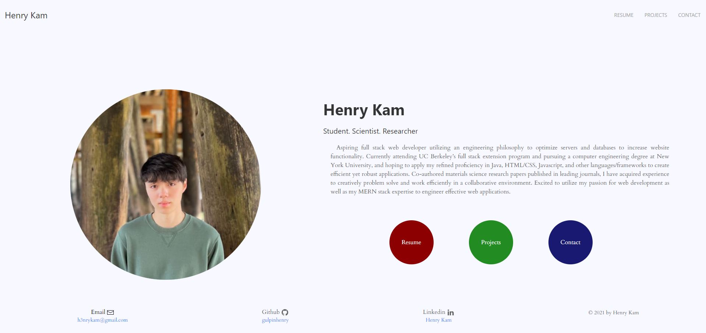

# portfolio-3

---

## Table of Contents

- [portfolio-3](#portfolio-3)
  - [Table of Contents](#table-of-contents)
  - [Description](#description)
  - [Prerequisites](#prerequisites)
  - [Built With](#built-with)
  - [Technologies Used](#technologies-used)
  - [Practices Used](#practices-used)
  - [Deployed Link](#deployed-link)
  - [Authors](#authors)
  - [License](#license)
  - [Questions](#questions)
  

## Description

An updated version of my portfolio!

[Click this link to go to the live site](https://gulpinhenry.github.io/portfolio-3/)
  

## Prerequisites
Any modern internet browser will do!

## Built With

* [HTML](https://developer.mozilla.org/en-US/docs/Web/HTML)
* [CSS](https://developer.mozilla.org/en-US/docs/Web/CSS)
* [UI Kit](https://getuikit.com/)

## Technologies Used

* [Microsoft Visual Studio Code](https://code.visualstudio.com/)
* [Git Bash](https://git-scm.com/downloads)
* [GitHub](https://github.com/)
* [NVDA Screen Reader](https://www.nvaccess.org/)
* [WAVE Web Accessibility Evaluation Tool](https://wave.webaim.org/)
* [Lighthouse](https://developers.google.com/web/tools/lighthouse/)
* [Google Chrome Developer Tools](https://developer.chrome.com/docs/devtools/)

## Practices Used

* [Web Content Accessibility Guidelines](https://www.w3.org/WAI/standards-guidelines/wcag/)

## Deployed Link

* [See the Live Site!](https://gulpinhenry.github.io/portfolio-2/)

## Authors

**Henry Kam**

- [Link to Henry's Github](https://github.com/gulpinhenry)
- [Link to Henry's LinkedIn](https://www.linkedin.com/in/kamhenry/)

## License

This application is covered under the MIT license

## Questions

For any questions, please reach out by creating an issue.